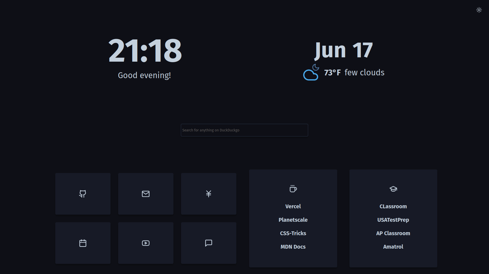

#Sia's Startpage

This is my personal twist on migueravila's [Bento](https://github.com/migueravila/Bento), themed to firefox [Sweet_Pop!](https://github.com/PROxZIMA/Sweet-Pop) and upgraded with a built-in searchbar suggested [here](https://github.com/migueravila/Bento/issues/14).

##Commands

But of course I couldn't leave it there. As the snazzy vim user I am, it's a shame I can't use similar keybinds in my browser- until now. (Still under development and subject to changes)
Currently you can switch between search engines, but I plan to add a theme toggle, layout toggle, and bookmark access.

Commands start with `:`
Use...
G => search Google
D => search DuckDuckgo
S => search Startpage
W => search Wikipedia
A => search Amazon
\ => Clear the search bar at any point (Universal, no need for modifier)

>These will likely be changed to multi-character commands in the future to distinguish between categories.

>All commands are paste-safe and will <u>only</u> activate when typed.

##Before you start
You can use the [plain one](https://github.com/Siarune/siastartpage/tree/stable), which is only feature-updated, or my [personalized version](https://github.com/Siarune/siastartpage/tree/master). 
I would recommend forking and hosting a branch of your one so you can change the configs to your liking, but you do you.
For more detailed documentation, see the original project's readme.